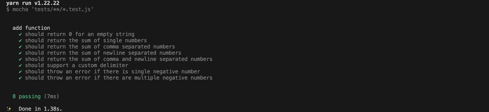

# Incubyte TDD Assignment: String Calculator
This is a assignment for string calculator that returns sum of numbers in a string, supports different delimiters and handles negative numbers

The project is built using **JavaScript** and follows a **Test-Driven Development (TDD)** approach using **Mocha & Chai** for testing.

## Setup Instructions
- ```git clone https://github.com/haresh6x/incubyte-tdd-assignment.git```
- ```cd incubyte-tdd-assignment```
- ```yarn``` to install all the dependencies
- Run ```yarn test``` to test the application

## Test Cases
### 1. Empty: 
- [This test case returns 0 if the string is empty](https://github.com/haresh6x/incubyte-tdd-assignment/tree/feature/add-tests) 

### 2. Sum: 
- [This test case returns the sum of numbers in a string using comma delimeter](https://github.com/haresh6x/incubyte-tdd-assignment/tree/feature/sum-numbers-test)

### 3. Newline:
- [This test case returns the sum of numbers in a string using new line delimiter](https://github.com/haresh6x/incubyte-tdd-assignment/tree/feature/new-line-numbers-test)

### 4. Custom: 
- [This test case returns the sum of numbers in a string using custom delimiter](https://github.com/haresh6x/incubyte-tdd-assignment/tree/feature/custom-delimeters-test)

### 5. Negative: 
- [This test case throws new error in a string if negative numbers are present](https://github.com/haresh6x/incubyte-tdd-assignment/tree/feature/negative-numbers-test)

## Test Results
